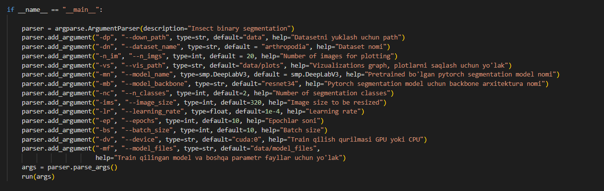
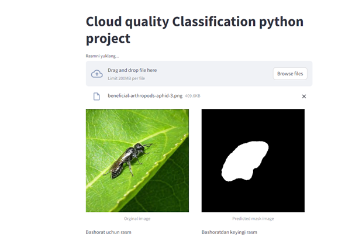
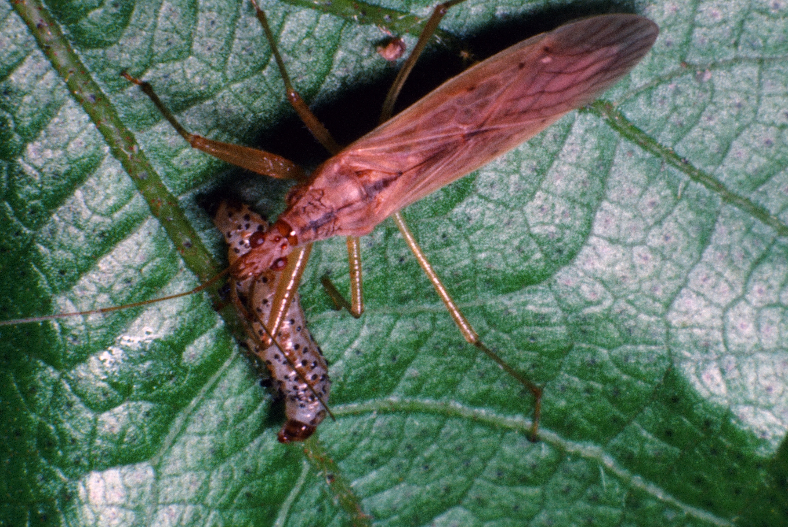

# Arthropodia insect binary segmentation with DeepLabV3


## Project Overview
Binary segmentaion task fulfilled by DeepLabV3 model using transfer learning method. Dataset images are collected from tropical Malaysian forests and encompasses a diverse range of arthropod species captured under various lighting and environmental conditions.And Streamlit is used to create an interactive web demo.

## Installation

To set up the project environment:
#### 1-method

```bash
git clone https://github.com/cengineer13/Arthropodia-insect-binary-segmentation-with-DeepLabV3.git
cd project root folder
pip install -r requirements.txt
```

#### 2-method

Create conda environment using two methods:

a) Create a virtual environment using yml file:

```python
conda env create -f environment.yml
```

Then activate the environment using the following command:
```python
conda activate ds
```

b) Create a virtual environment using txt file:

- Create a virtual environment:

```python
conda create -n ds python=3.10
```

- Activate the environment using the following command:

```python
conda activate ds
```

- Install libraries from the text file:

```python
pip install -r requirements.txt
```

## Dataset

There are 4,949 original images and 4,949 corresponding segmentation masks in the dataset. The dataset images contain 2 classes, namely background and foreground; so this task can be considered as binary semantic segmentation task.

* Download dataset from the [link](https://www.kaggle.com/datasets/killa92/arthropodia-semantic-segmentation-dataset).


## Model Performance

The model's training and validation metrics are visualized below:


The curves represent the model's Loss, PA (pixel accuracy) and mIOU metrics over epochs, indicating the learning process and convergence.

## Inference

Here's how the model performs on the test set:


Each row shows the ground truth and predicted label for brain CT images.

### Arguments for training 
* Train the model using the following arguments:



```python

python main.py  --batch_size 32 --epochs 15

```

## Testing on New Data &  Interactive Web Demo

A Streamlit web app (`demo.py`) allows users to upload an image and receive model predictions in a user-friendly interface.

```bash
streamlit run demo.py
```
Result: 


To evaluate the model on new, I used this unseen images:




These are examples of new data images can be passed through the model and testify model how it is working on.


## Contributing

We welcome contributions from the community. Please read the contributing guidelines first before making a pull request.


## Contact

Mr Murodil  - murodild@gmail.com
LinkedIn - https://www.linkedin.com/in/mr-murodil
Portfolio Link: [www.cengineer.uz](http://www.cengineer.uz)
